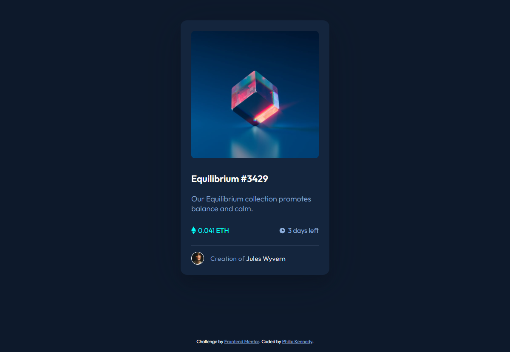

# Frontend Mentor - NFT Preview Card Component

This is my solution for the [NFT Preview Card Component](https://www.frontendmentor.io/challenges/nft-preview-card-component-SbdUL_w0U) (Newbie Challenge) on Frontend Mentor.

## Table of Contents

- [Overview](#overview)
  - [The Challenge](#the-challenge)
  - [Screenshot](#screenshot)
  - [Links](#links)
- [My Process](#my-process)
  - [Built with](#built-with)
  - [What I Learned](#what-i-learned)
  - [Useful Resources](#useful-resources)
- [Author](#author)

## Overview

### The Challenge

- **Difficulty -** `Newbie`

The challenge is to build out this NFT Preview Card Component and get it looking as close to the design as possible.

The users should be able to:

- View the optimal layout depending on their device's screen size
- See hover states for interactive elements

### Screenshot

### Links

- **Solution URL -** [Frontend Mentor Solution](https://www.frontendmentor.io/solutions/nft-preview-card-component-i2ARSDAYL7)

- **Live Site URL -** [Live Site Preview (Vercel)](https://nft-preview-card-component-phlpknndy.vercel.app/)

## My Process

### Built with

- Semantic HTML5 markup
- CSS custom properties
- Flexbox

### What I Learned

How to appropriately use the BEM (Block-Element-Modifier) naming convention and apply it to CSS class names.

Alphabetising CSS properties to improve code readability while reducing the chance of errors (duplicate rules etc.)

How to create reusable CSS colour variables and apply them when necessary.

How to create an image overlay icon effect on hover.

### Useful Resources

- [BEM Naming Convention](https://getbem.com/naming/) **-** Useful reference for the BEM naming convention.

- [CSS Custom Properties (Variables)](https://developer.mozilla.org/en-US/docs/Web/CSS/Using_CSS_custom_properties) **-** Useful reference for creating reusable CSS colour variables.

- [Image Overlay Icon](https://www.w3schools.com/howto/howto_css_image_overlay_icon.asp) **-** Useful reference for creating an image overlay icon effect on hover.

## Author

- **Github -** [PhlpKnndy](https://github.com/PhlpKnndy)
- **Frontend Mentor -** [PhlpKnndy](https://www.frontendmentor.io/profile/PhlpKnndy)
